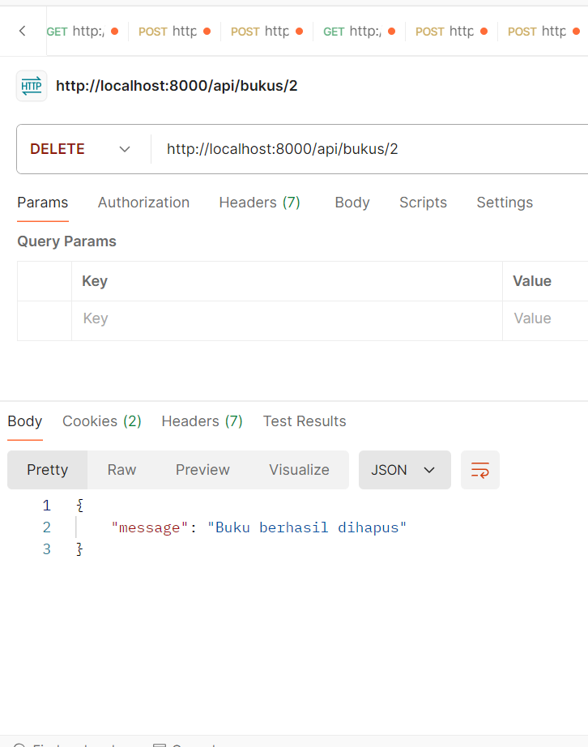

## pratikum bookmart api 

## get semua kategori 

## post menambah kategori baru 

## get semua buku 

## post menambah buku baru 

## get buku berdasarkan id 

## put update data buku 

## delete hapus buku 

## tugas 

##   1.	  Tambahkan Validasi:
##	      Nama buku tidak boleh kosong.    
##	      Harga minimal Rp 1.000.
##   2.	  Rancang Endpoint Baru:
##        Buatlah satu endpoint tambahan untuk sistem toko buku, misalnya, endpoint untuk mencari buku berdasarkan ##        kategori atau judul. Tantangan: Apa pertimbangan yang harus Anda buat saat merancang endpoint ini?       ##        Pertimbangkan aspek performa, skalabilitas, dan pengalaman pengguna.
